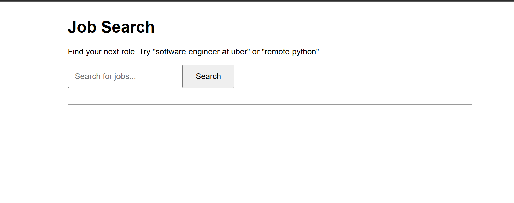
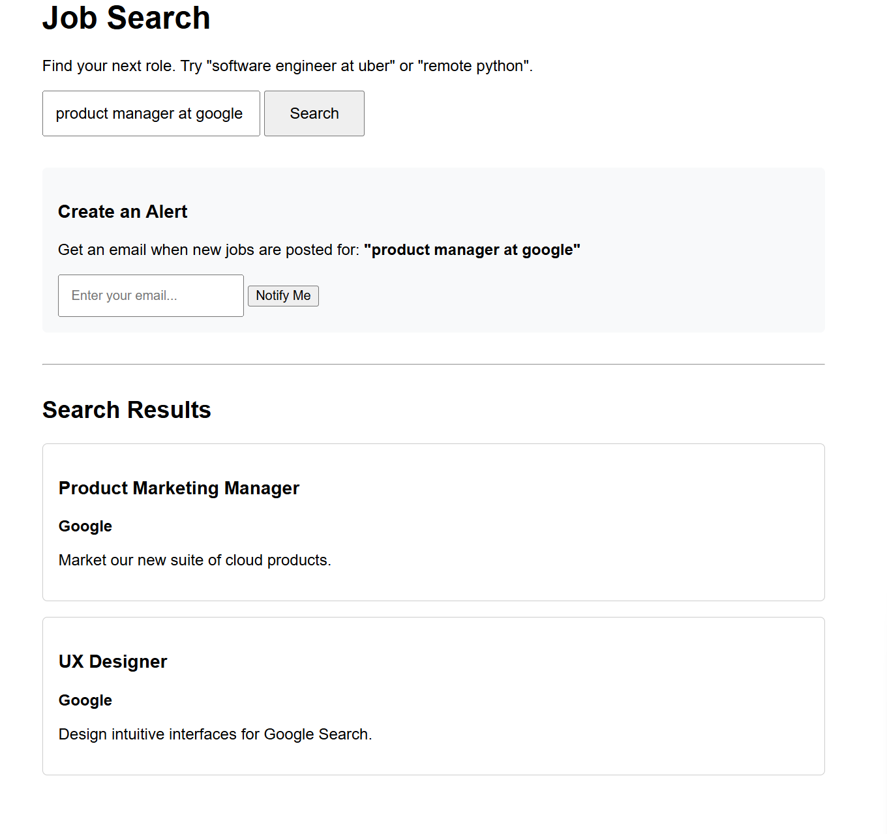

# Openroles

Openroles is a lightweight job search engine built with Ruby on Rails. It allows users to search for job postings with advanced, typo-tolerant search powered by Elasticsearch and create email alerts to be notified of new roles matching their criteria.

## Key Features

*   **Powerful Job Search:** Utilizes Elasticsearch via the Searchkick gem for fast, relevant, and typo-tolerant search results.
*   **Custom Job Alerts:** Users can save any search query and receive email notifications when new jobs are posted that match their criteria.
*   **Secure Unsubscribe:** Email notifications include a secure, signed link to unsubscribe from alerts, protecting user privacy.
*   **Background Job Processing:** Uses GoodJob for reliable, database-backed background processing of email alerts.
*   **JSON API:** Provides a simple, versioned API to retrieve jobs for a specific company.
*   **Containerized Environment:** Docker Compose for easy and consistent setup of db and elasticsearch

## Screenshots


| Search Page                                        | Search Results & Alert Form                               | Email Notification                                  |
| -------------------------------------------------- | --------------------------------------------------------- | --------------------------------------------------- |
|  |  |  |
| *simple interface for searching jobs.*  | *Displaying results with an option to create an alert.*   | *The email a user receives for a new job alert.*    |


## Technical Overview & Architecture

The application is a standard Ruby on Rails monolith. It relies on PostgreSQL as its primary database for storing jobs, companies, and alerts. For the search functionality, it integrates with Elasticsearch to provide a superior user experience. Background jobs, such as sending alert emails, are managed by GoodJob, which uses the PostgreSQL database, avoiding the need for a separate Redis instance.

### System Diagram


## Design Decisions


#### 1. Advanced Search with Elasticsearch and Searchkick
Instead of a basic database `LIKE` query, we chose Elasticsearch for its powerful, AI-enhanced search capabilities. This provides a superior user experience with features like:
*   **Typo Tolerance:** A search for "softwre enginer" can still return relevant "Software Engineer" roles.
*   **Field Boosting:** Search terms found in the job `title` are weighted more heavily (`^5`) than those in the `company_name` (`^3`), ensuring the most relevant results appear first.
*   **Scalability:** As the job board grows to index thousands or millions of jobs from across the internet, Elasticsearch provides the performance and scalability that a traditional database search cannot match.

#### 2. Simplified Infrastructure with GoodJob
For background job processing, **GoodJob** was selected for its **simplicity**. It leverages our existing PostgreSQL database as its queuing backend. This was a deliberate choice to reduce infrastructure complexity. It avoids the operational overhead of setting up, managing, monitoring, and backing up a separate Redis instance, which would be required for alternatives like Sidekiq. This simplifies the tech stack, which is ideal for this project's scope.

#### 3. Consistent Development with Docker
The entire development environment is managed via Docker and Docker Compose. the exact same versions of Ruby, PostgreSQL, and Elasticsearch.

## Prerequisites

Before you begin, ensure you have the following installed on your system:
*   [Docker](https://docs.docker.com/get-docker/)
*   [Docker Compose](https://docs.docker.com/compose/install/)
*   [Git](https://git-scm.com/)

## Local Development Setup

The entire development environment is managed by Docker Compose, making setup quick and easy.

1.  **Clone the Repository**
    ```bash
    git clone https://github.com/BentleyOph/openroles.git
    cd openroles
    ```

2.  **Build and Start the Services**
    This command will build the Docker images for the web service, and pull the required images for PostgreSQL and Elasticsearch. It will then start all services in the background.

    ```bash
    docker-compose up -d
    ```

3.  **Set Up the Database**
    The first time you start the application, you need to create the database, run migrations, and seed it with initial data.

    ```bash
    # Create and migrate the database
    bin/rails db:setup

    # Seed the database with sample companies and jobs
    bin/rails db:seed
    ```
    The `db:seed` command also automatically re-indexes the new `Job` records in Elasticsearch.

4.  **Access the Application**
    You can now access the application and its development tools at the following URLs:
    *   **Main Application:** [http://localhost:3000](http://localhost:3000)
    *   **GoodJob Dashboard:** [http://localhost:3000/good_job](http://localhost:3000/good_job)
    *   **Mail Previews (LetterOpener):** [http://localhost:3000/letter_opener](http://localhost:3000/letter_opener)

To stop the services, run `docker-compose down`.

## How It Works: The Alert System

1.  A user performs a search (e.g., "remote python").
2.  On the results page, they enter their email into the "Create an Alert" form.
3.  This creates a new `Alert` record in the database with the `query` and `email`.
4.  The `AlertMatcherJob` is responsible for checking for new jobs. This job runs on a schedule.
5.  When the job runs, it finds all jobs created in the last 24 hours.
6.  It then iterates through every `Alert` in the system and performs an Elasticsearch search using the alert's query.
7.  It finds the intersection between *newly created jobs* and the *search results for the alert*.
8.  If any matching jobs are found, it sends a single email to the user containing all the new job listings.

## How to test email 
Make sure the server is running

1. Create a new alert using the search form.
2. Go to rails console and create a job manually for a specific company e.g 
```
startup_company = Company.find_by(name: "Stealth Startup")
Job.create!(title:", description: "A new role for python devs.", company: startup_company, remote: true)
Job.reindex
```
3. Trigger the `AlertMatcherJob` manually using the command `bin/rails alerts:check`.
4. Check the email inbox(localhost:3000/letter_opener) to see the emails 

## Scheduling Alerts in Production

In a production environment, you need to run the `AlertMatcherJob` on a regular basis (e.g., every hour). With GoodJob, this is straightforward using its built-in cron-style scheduler.

You can configure this by adding a schedule to `config/application.rb` inside the `Application` class:

```ruby
module Openroles
  class Application < Rails::Application
    # ... existing configuration ...

    # Configure GoodJob's cron-like scheduler
    config.good_job.cron = {
      alert_matcher: {
        cron: '0 * * * *', # Every hour at the beginning of the hour
        class: 'AlertMatcherJob',
        description: 'Checks for new jobs and sends email alerts to users.'
      }
    }
  end
end
```

When you deploy, the GoodJob scheduler will automatically pick up this configuration and enqueue the `AlertMatcherJob` at the specified interval.

## API Endpoints

The application exposes a simple, read-only JSON API.

### Get Jobs for a Company

*   **Endpoint:** `GET /api/v1/companies/:company_name/jobs`
*   **Description:** Returns a JSON array of all jobs associated with a company. The company name is case-insensitive.
*   **Example Request:**
    ```bash
    curl http://localhost:3000/api/v1/companies/uber/jobs
    ```
*   **Example Response (200 OK):**
    ```json
    [
      {
        "id": 1,
        "title": "Senior Software Engineer",
        "description": "Build the future of transportation with Ruby and Go.",
        "remote": false,
        "company_id": 1,
        "created_at": "2023-10-27T10:00:00.000Z",
        "updated_at": "2023-10-27T10:00:00.000Z"
      },
      {
        "id": 4,
        "title": "Backend Engineer (Payments)",
        "description": "Join the team that processes millions of transactions.",
        "remote": true,
        "company_id": 1,
        "created_at": "2023-10-27T10:00:00.000Z",
        "updated_at": "2023-10-27T10:00:00.000Z"
      }
    ]
    ```
*   **Response (404 Not Found):**
    If the company does not exist.
    ```json
    {
      "error": "Company not found"
    }
    ```
